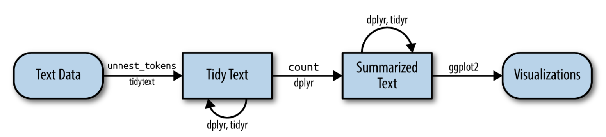
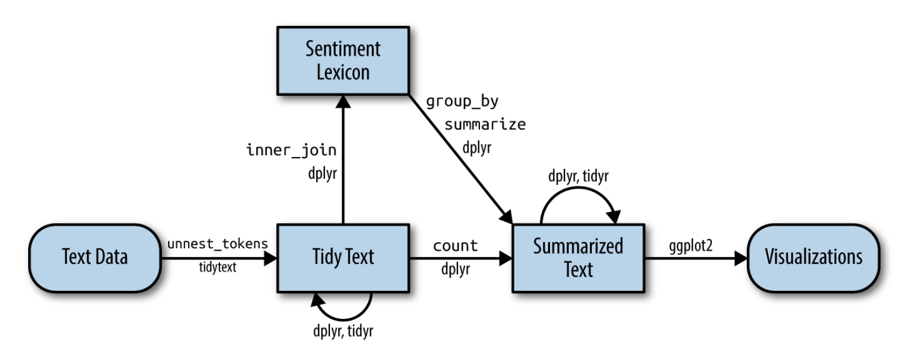

With the exception of string processing, the majority of our course has focused on numeric data. This is mainly because most of the data the average data scientist works with is numeric. However, today more and more text data is being collected and knowing even some basic text mining terminology and techniques like sentiment analysis go a long way. Here, we will see a brief introduction to text data structure and simple text mining. For more details about basic text mining in R, see the freely available book [Text Mining with R](https://www.tidytextmining.com/index.html) by Julia Silge and David Robinson (2 of the people I receommend following on Twitter the first day of class). All of the code for this lecture has been adapted from their book.

## Tidy Text
Similar to how we defined [tidy data](https://github.com/datasciencelabs/2020/blob/master/03_wrangling/01_tidy-data.Rmd) in the wrangling module, here we define the tidy text format as being a table with **one-token-per-row**. A **token** is a meaningful unit of text, such as a word (but could also be a sentence, n-gram, etc.), that we are interested in using for analysis, and **tokenization** is the process of splitting text into tokens. If we structure our text data into this tidy format we will be able to use the pipe, ggplot2, and all other functions/packages created for tidy data.



Note: all of the packages needed to run the code in this file are listed below. Be sure you have installed each of them before trying to load them. Most are new packages we haven't used in the course before.

```{r, message=FALSE, warning=FALSE}
library(tidytext)
library(textdata)
library(dplyr)
library(stringr)
library(janeaustenr)
library(ggplot2)
library(gutenbergr)
library(scales)
library(tidyr)
```

Let's use the text of Jane Austen's 6 completed, published novels from the `janeaustenr` package (Silge 2016), and transform them into a tidy format. The `janeaustenr` package provides these texts in a one-row-per-line format, where a line in this context is analogous to a literal printed line in a physical book. Let's start with that, and also use `mutate()` to annotate a `linenumber` quantity to keep track of lines in the original format and a chapter (using a regex) to find where all the chapters are.

```{r}
original_books <- austen_books() %>%
  group_by(book) %>%
  mutate(linenumber = row_number(),
         chapter = cumsum(str_detect(text, 
                                     regex("^chapter [\\divxlc]",
                                           ignore_case = TRUE)))) %>%
  ungroup()
original_books
```
To work with this as a tidy dataset, we need to restructure it in the one-token-per-row format, which can be done with the `unnest_tokens()` function.

The two basic arguments to `unnest_tokens` used here are column names. First we have the output column name that will be created as the text is unnested into it (`word`, in this case), and then the input column that the text comes from (`text`, in this case).

After using `unnest_tokens` note:

* Other columns, such as the line number each word came from, are retained.

* Punctuation has been stripped.

* By default, `unnest_tokens()` converts the tokens to lowercase, which makes them easier to compare or combine with other datasets. (Use the `to_lower = FALSE` argument to turn off this behavior).

```{r}
tidy_books <- original_books %>%
  unnest_tokens(word, text)
tidy_books
```

Now that the data is in one-word-per-row format, we can manipulate it with tidy tools like dplyr. Often in text analysis, we will want to remove **stop words**. Stop words are words that are not useful for an analysis, typically extremely common words such as "the", "of", "to", and so forth in English. We can remove stop words (kept in the tidytext dataset `stop_words`) with an `anti_join()`.

```{r}
data(stop_words)

tidy_books <- tidy_books %>%
  anti_join(stop_words, by = "word")
```

We can also use dplyr’s `count()` to find the most common words in all the books as a whole.

```{r}
tidy_books %>%
  count(word, sort = TRUE)
```

Because we've been using tidy tools, our word counts are stored in a tidy data frame. This allows us to pipe this directly to the `ggplot2` package and to create a visualization of the most common words.

```{r}
tidy_books %>%
  count(word, sort = TRUE) %>%
  filter(n > 600) %>%
  mutate(word = reorder(word, n)) %>%
  ggplot(aes(n, word)) +
  geom_col(color = "black") +
  labs(y = NULL)
```

## Word Frequencies
A common task in text mining is to look at word frequencies, just like we have done above for Jane Austen's novels, and to compare frequencies across different texts. We can do this intuitively and smoothly using tidy data principles. We already have Jane Austen’s works; let’s get two more sets of texts to compare to. We will use the `gutenbergr` package.

The `gutenbergr` package provides access to the public domain works from the [Project Gutenberg](https://www.gutenberg.org/) collection. The package includes tools both for downloading books (stripping out the unhelpful header/footer information), and a complete dataset of Project Gutenberg metadata that can be used to find works of interest.

We can access these works using `gutenberg_download()` and the [Project Gutenberg ID](https://www.gutenberg.org/browse/scores/top) numbers for each novel.

Let's look at two Charles Dickens books: 

1. A Christmas Carol (Project Gutenberg ID: 19337)
2. Oliver Twist (Project Gutenberg ID: 730)

```{r, message=FALSE}
dickens <- gutenberg_download(c(19337, 730))
```

We again use `unnest_tokens` and remove stop words. 

```{r}
tidy_dickens <- dickens %>%
  unnest_tokens(word, text) %>%
  anti_join(stop_words, by = "word")
```

Here are the most common words in these two novels:

```{r}
tidy_dickens %>%
  count(word, sort = TRUE)
```
Now let's get some well-known works of the Brontë sisters, whose lives overlapped with Jane Austen’s somewhat but who wrote in a rather different style. 

1. Jane Eyre (Project Gutenberg ID: 1260)
2. Wuthering Heights (Project Gutenberg ID: 768)

```{r}
bronte <- gutenberg_download(c(1260, 768))
```

We again use `unnest_tokens` and remove stop words. 

```{r}
tidy_bronte <- bronte %>%
  unnest_tokens(word, text) %>%
  anti_join(stop_words, by = "word")
```

Here are the most common words in these two novels:

```{r}
tidy_bronte %>%
  count(word, sort = TRUE)
```
It looks like the word "time" is one of the most common words across all three authors.

Now let's calculate the frequency for each word for the works of the three authors by binding the data frames together. We can use `spread` and `gather` from `dplyr` to reshape our data frame so that it is just what we need for plotting and comparing the three sets of novels.

We use `str_extract()` here because the UTF-8 encoded texts from Project Gutenberg have some examples of words with underscores around them to indicate emphasis (like italics). The tokenizer treated these as words, but we don’t want to count "_any_" separately from "any" as we saw in our initial data exploration before choosing to use `str_extract()`.

```{r}
frequency <- bind_rows(mutate(tidy_bronte, author = "Brontë Sisters"),
                       mutate(tidy_dickens, author = "Charles Dickens"), 
                       mutate(tidy_books, author = "Jane Austen")) %>% 
  mutate(word = str_extract(word, "[a-z']+")) %>%
  count(author, word) %>%
  group_by(author) %>%
  mutate(proportion = n / sum(n)) %>% 
  select(-n) %>% 
  spread(author, proportion) %>% 
  gather(author, proportion, `Brontë Sisters`:`Charles Dickens`)

head(frequency)
```

Let's make the plot. Note that we surround the Jane Austen column name with back ticks (``) since it is a non-standard variable name - it has a space between the two names, which R doesn't like. You could get around this by naming the variable Jane_Austen, for example. 

```{r}
frequency %>% ggplot(aes(x = proportion, y = `Jane Austen`, 
                      color = abs(`Jane Austen` - proportion))) +
  geom_abline(color = "gray40", lty = 2) +
  geom_jitter(alpha = 0.1, size = 2.5, width = 0.3, height = 0.3) +
  geom_text(aes(label = word), check_overlap = TRUE, vjust = 1.5) +
  scale_x_log10(labels = percent_format()) +
  scale_y_log10(labels = percent_format()) +
  scale_color_gradient(limits = c(0, 0.001), 
                       low = "darkslategray4", high = "gray75") +
  facet_wrap(~author, ncol = 2) +
  theme(legend.position="none") +
  labs(y = "Jane Austen", x = NULL)
```

Words that are close to the line in these plots have similar frequencies in both sets of texts, for example, in both Austen and Brontë texts ("miss", "time", "day" at the upper frequency end) or in both Austen and Dickens texts ("time", "day", "mind" at the high frequency end). Words that are far from the line are words that are found more in one set of texts than another. For example, in the Austen-Brontë panel, words like "elizabeth" and "bath" are found in Austen’s texts but not much in the Brontë texts, while words like "dog" and "can" are found in the Brontë texts but not the Austen texts. In comparing Dickens with Jane Austen, Dickens uses words like "oliver" and "jew", and that Austen does not, while Austen uses words like "captain" and "edward" that Dickens does not.

Overall, notice that the words in the Austen-Brontë panel are closer to the zero-slope line than in the Austen-Dickens panel. Also notice that the words extend to lower frequencies in the Austen-Brontë panel; there is empty space in the Austen-Dickens panel at low frequency. These characteristics indicate that Austen and the Brontë sisters use more similar words than Austen and Dickens.

Let's quantify how similar and different these sets of word frequencies are using a correlation test. How correlated are the word frequencies between Austen and the Brontë sisters, and between Austen and Dickens?


```{r}
cor.test(data = frequency[frequency$author == "Brontë Sisters",],
         ~ proportion + `Jane Austen`)
```


```{r}
cor.test(data = frequency[frequency$author == "Charles Dickens",], 
         ~ proportion + `Jane Austen`)
```
Just as we saw in the plots, the word frequencies are more correlated between the Austen and Brontë novels than between Austen and Dickens.


## Sentiment Analysis
When human readers approach a text, we use our understanding of the emotional intent of words to infer whether a section of text is positive or negative, or perhaps characterized by some other more nuanced emotion like surprise or disgust. We can use the tools of text mining to approach the emotional content of text programmatically.


One way to analyze the sentiment of a text is to consider the text as a combination of its individual words and the sentiment content of the whole text as the sum of the sentiment content of the individual words. This isn’t the only way to approach sentiment analysis, but it is an often-used approach, and an approach that naturally takes advantage of the tidy tool ecosystem.

### Sentiments Datasets

As discussed above, there are a variety of methods and dictionaries that exist for evaluating the opinion or emotion in text. The `tidytext` package provides access to several sentiment lexicons. Three general-purpose lexicons are

* `AFINN` from Finn Årup Nielsen

* `bing` from Bing Liu and collaborators

* `nrc` from Saif Mohammad and Peter Turney

All three of these lexicons are based on unigrams (single words). These lexicons contain many English words and the words are assigned scores for positive/negative sentiment, and also possibly emotions like joy, anger, sadness, and so forth. The `nrc` lexicon categorizes words in a binary fashion ("yes"/"no") into categories of positive, negative, anger, anticipation, disgust, fear, joy, sadness, surprise, and trust. The `bing` lexicon categorizes words in a binary fashion into positive and negative categories. The `AFINN` lexicon assigns words with a score that runs between -5 and 5, with negative scores indicating negative sentiment and positive scores indicating positive sentiment.

The function `get_sentiments()` allows us to get specific sentiment lexicons with the appropriate measures for each one.

```{r}
get_sentiments("afinn")
```


```{r}
get_sentiments("bing")
```


```{r}
get_sentiments("nrc")
```

With data in a tidy format, sentiment analysis can be done as an inner join. This is another of the great successes of viewing text mining as a tidy data analysis task; much as removing stop words is an anti-join operation, performing sentiment analysis is an inner join operation.

Let’s look at the words with a joy score from the NRC lexicon. What are the most common joy words in Emma? First, we need to take the text of the novels and convert the text to the tidy format using `unnest_tokens()`. Let’s also set up some other columns to keep track of which line and chapter of the book each word comes from. We use `group_by` and `mutate` to construct those columns.

```{r}
tidy_books <- austen_books() %>%
  group_by(book) %>%
  mutate(linenumber = row_number(),
    chapter = cumsum(str_detect(text, 
                                regex("^chapter [\\divxlc]", 
                                      ignore_case = TRUE)))) %>%
  ungroup() %>%
  unnest_tokens(word, text)
```

Notice that we chose the name word for the output column from `unnest_tokens()`. This is a convenient choice because the sentiment lexicons and stop word datasets have columns named word; performing inner joins and anti-joins is thus easier.

Now that the text is in a tidy format with one word per row, we are ready to do the sentiment analysis. First, let's use the NRC lexicon and `filter()` for the joy words. Next, let's `filter()` the data frame with the text from the books for the words from Emma and then use `inner_join()` to perform the sentiment analysis. What are the most common joy words in Emma? Let’s use `count()` from dplyr.

```{r}
nrc_joy <- get_sentiments("nrc") %>% 
  filter(sentiment == "joy")

tidy_books %>%
  filter(book == "Mansfield Park") %>%
  inner_join(nrc_joy) %>%
  count(word, sort = TRUE)
```

We see mostly positive, happy words about hope, friendship, and love here. We also see some words that may not be used joyfully by Austen ("found", "present").

We can also examine how sentiment changes throughout each novel. We can do this with just a handful of lines that are mostly dplyr functions. First, we find a sentiment score for each word using the `Bing` lexicon and `inner_join()`.

Next, we count up how many positive and negative words there are in defined sections of each book. We define an index here to keep track of where we are in the narrative; this index (using integer division) counts up sections of 80 lines of text.

The `%/%` operator does integer division (`x %/% y` is equivalent to `floor(x/y)`) so the index keeps track of which 80-line section of text we are counting up negative and positive sentiment in.

**Small sections of text may not have enough words in them to get a good estimate of sentiment while really large sections can wash out narrative structure. For these books, using 80 lines works well, but this can vary depending on individual texts, how long the lines were to start with, etc**. We then use `spread()` so that we have negative and positive sentiment in separate columns, and lastly calculate a net sentiment (positive - negative).


```{r}
jane_austen_sentiment <- tidy_books %>%
  inner_join(get_sentiments("bing"), by = "word") %>%
  count(book, index = linenumber %/% 80, sentiment) %>%
  spread(sentiment, n, fill = 0) %>%
  mutate(sentiment = positive - negative)
```


```{r}
ggplot(jane_austen_sentiment, aes(index, sentiment, fill = book)) +
  geom_col(show.legend = FALSE) +
  facet_wrap(~book, ncol = 2, scales = "free_x")
```
We can see how the plot of each novel changes toward more positive or negative sentiment over the trajectory of the story.


### Most common positive and negative words

One advantage of having the data frame with both sentiment and word is that we can analyze word counts that contribute to each sentiment. By implementing `count()` here with arguments of both word and sentiment, we find out how much each word contributed to each sentiment.

```{r}
bing_word_counts <- tidy_books %>%
  inner_join(get_sentiments("bing"), by = "word") %>%
  count(word, sentiment, sort = TRUE) %>%
  ungroup()

bing_word_counts
```

This can be shown visually, and we can pipe straight into `ggplot2`, if we like, because of the way we are consistently using tools built for handling tidy data frames.

```{r}
bing_word_counts %>%
  group_by(sentiment) %>%
  top_n(10) %>%
  ungroup() %>%
  mutate(word = reorder(word, n)) %>%
  ggplot(aes(n, word, fill = sentiment)) +
  geom_col(show.legend = FALSE) +
  facet_wrap(~sentiment, scales = "free_y") +
  labs(x = "Contribution to sentiment",
       y = NULL)
```

## Word Clouds

Let’s look at the most common words in Jane Austen's works as a whole again, but this time as a wordcloud. The bigger the word, the more common it is. The colors here correspond to the size and are to make the plot "pretty" - they don't add any other information except to act as size categories.

```{r}
library(RColorBrewer)
library(wordcloud)

tidy_books %>%
  anti_join(stop_words, by = "word") %>%
  count(word) %>%
  with(wordcloud(word, n, max.words = 100, colors=brewer.pal(8, "Dark2")))
```

In other functions, such as `comparison.cloud()`, you may need to turn the data frame into a matrix with `reshape2`'s `acast()` function. Let's do the sentiment analysis to tag positive and negative words using an inner join, then find the most common positive and negative words. Until the step where we need to send the data to `comparison.cloud()`, this can all be done with joins, piping, and dplyr because our data is in tidy format.

```{r, message=FALSE}
library(reshape2)

tidy_books %>%
  inner_join(get_sentiments("bing"), by = "word") %>%
  count(word, sentiment, sort = TRUE) %>%
  acast(word ~ sentiment, value.var = "n", fill = 0) %>%
  comparison.cloud(max.words = 100, colors=brewer.pal(8, "Dark2"))
```

Let's make the same wordclouds for the Brontë novels.

```{r, warning=FALSE}
tidy_bronte %>%
  anti_join(stop_words, by = "word") %>%
  count(word) %>%
  with(wordcloud(word, n, max.words = 100, colors=brewer.pal(8, "Dark2")))
```

```{r, message=FALSE}
tidy_bronte %>%
  inner_join(get_sentiments("bing"), by = "word") %>%
  count(word, sentiment, sort = TRUE) %>%
  acast(word ~ sentiment, value.var = "n", fill = 0) %>%
  comparison.cloud(max.words = 100, colors=brewer.pal(8, "Dark2"))
```

And finally, the Dickens novels. 

```{r}
tidy_dickens %>%
  anti_join(stop_words, by = "word") %>%
  count(word) %>%
  with(wordcloud(word, n, max.words = 100, colors=brewer.pal(8, "Dark2")))
```

```{r, message=FALSE, warning=FALSE}
tidy_dickens %>%
  inner_join(get_sentiments("bing"), by = "word") %>%
  count(word, sentiment, sort = TRUE) %>%
  acast(word ~ sentiment, value.var = "n", fill = 0) %>%
  comparison.cloud(max.words = 100, colors=brewer.pal(8, "Dark2"))
```

## Word and Document Frequency: tf-idf

A central question in text mining and natural language processing is how to quantify what a document is about. Can we do this by looking at the words that make up the document? One measure of how important a word may be is its **term frequency (tf)**, how frequently a word occurs in a document. There are words in a document, however, that occur many times but may not be important. In English, these are probably words like "the", "is", "of", etc. We might take the approach of adding words like these to a list of stop words and removing them before analysis, but it is possible that some of these words might be more important in some documents than others. A list of stop words is not a very sophisticated approach to adjusting term frequency for commonly used words.

Another approach is to look at a term's **inverse document frequency (idf)**, which decreases the weight for commonly used words and increases the weight for words that are not used very much in a collection of documents. **This can be combined with term frequency to calculate a term's tf-idf (the two quantities multiplied together), the frequency of a term adjusted for how rarely it is used**.

The statistic tf-idf is intended to measure how important a word is to a document in a collection (or corpus) of documents, for example, to one novel in a collection of novels or to one website in a collection of websites.

It is a rule-of-thumb or heuristic quantity; while it has proved useful in text mining, search engines, etc., its theoretical foundations are considered less than firm by information theory experts. The inverse document frequency for any given term is defined as

$$
idf(\text{term}) = \ln\left( \frac{n_{\text{documents}}}{n_{\text{documents containing term}}} \right)
$$

We can use tidy data principles, to approach tf-idf analysis and use consistent, effective tools to quantify how important various terms are in a document that is part of a collection.

### Term frequency

Let's start by again looking at the published novels of Jane Austen and examine first term frequency, then tf-idf. We can start just by using dplyr functions such as `group_by()` and `join()`. What are the most commonly used words in Jane Austen’s novels? (Let’s also calculate the total words in each novel here, for later use.)

```{r, message=FALSE}
book_words <- austen_books() %>%
  unnest_tokens(word, text) %>%
  count(book, word, sort = TRUE)

total_words <- book_words %>% 
  group_by(book) %>% 
  summarize(total = sum(n))

book_words <- left_join(book_words, total_words)

book_words
```

There is one row in this `book_words` data frame for each word-book combination; `n` is the number of times that word is used in that book and `total` is the total words in that book. The usual suspects are here with the highest `n`, "the", "and", "to", and so forth. Let's look at the distribution of `n/total` for each novel, the number of times a word appears in a novel divided by the total number of terms (words) in that novel. This is exactly what term frequency is.


```{r, message=FALSE, warning=FALSE}
ggplot(book_words, aes(n/total, fill = book)) +
  geom_histogram(show.legend = FALSE) +
  xlim(NA, 0.0009) +
  facet_wrap(~book, ncol = 2, scales = "free_y")
```

There are very long tails to the right for these novels (those extremely common words!) that we have not shown in these plots. These plots exhibit similar distributions for all the novels, with many words that occur rarely and fewer words that occur frequently.

### Zipf's Law

Distributions like those shown above are typical in language. In fact, those types of long-tailed distributions are so common in any given corpus of natural language (like a book, or a lot of text from a website, or spoken words) that the relationship between the frequency that a word is used and its rank has been the subject of study. A classic version of this relationship is called Zipf's law, after George Zipf, a 20th century American linguist.

**Zipf's law states that the frequency that a word appears is inversely proportional to its rank**.

Since we have the data frame we used to plot term frequency, we can examine Zipf's law for Jane Austen's novels with just a few lines of dplyr functions.

```{r}
freq_by_rank <- book_words %>% 
  group_by(book) %>% 
  mutate(rank = row_number(), 
         `term frequency` = n/total) %>%
  ungroup()

freq_by_rank
```
The `rank` column here tells us the rank of each word within the frequency table; the table was already ordered by `n` so we could use `row_number()` to find the rank. Then, we can calculate the term frequency in the same way we did before. Zipf's law is often visualized by plotting `rank` on the x-axis and term `frequency` on the y-axis, on logarithmic scales. Plotting this way, an inversely proportional relationship will have a constant, negative slope.

```{r}
freq_by_rank %>% 
  ggplot(aes(rank, `term frequency`, color = book)) + 
  geom_line(size = 1.1, alpha = 0.8, show.legend = FALSE) + 
  scale_x_log10() +
  scale_y_log10()
```

We see that all six of Jane Austen's novels are similar to each other, and that the relationship between rank and frequency does have negative slope. It is not quite constant, though; perhaps we could view this as a broken [power law](https://en.wikipedia.org/wiki/Power_law) with, say, three sections. Let's see what the exponent of the power law is for the middle section of the rank range.

```{r}
rank_subset <- freq_by_rank %>% 
  filter(rank < 500,
         rank > 10)

lm(log10(`term frequency`) ~ log10(rank), data = rank_subset)
```

Classic versions of Zipf's law have 
$$ \text{frequency} \propto \frac{1}{\text{rank}} $$
and we have in fact gotten a slope close to -1 here. Let's plot this fitted power law with the data to see how it looks.

```{r}
freq_by_rank %>% 
  ggplot(aes(rank, `term frequency`, color = book)) + 
  geom_abline(intercept = -0.62, slope = -1.1, 
              color = "gray50", linetype = 2) +
  geom_line(size = 1.1, alpha = 0.8, show.legend = FALSE) + 
  scale_x_log10() +
  scale_y_log10()
```

We have found a result close to the classic version of Zipf's law for the corpus of Jane Austen's novels. The deviations we see here at high rank are not uncommon for many kinds of language; a corpus of language often contains fewer rare words than predicted by a single power law. The deviations at low rank are more unusual. Jane Austen uses a lower percentage of the most common words than many collections of language. This kind of analysis could be extended to compare authors, or to compare any other collections of text.


### The `bind_tf_idf()` function

The idea of tf-idf is to find the important words for the content of each document by decreasing the weight for commonly used words and increasing the weight for words that are not used very much in a collection or corpus of documents, in this case, the group of Jane Austen's novels as a whole. Calculating tf-idf attempts to find the words that are important (i.e., common) in a text, but not too common. Let’s do that now.

The `bind_tf_idf()` function in the `tidytext` package takes a tidy text dataset as input with one row per token (term), per document. One column (`word` here) contains the terms/tokens, one column contains the documents (`book` in this case), and the last necessary column contains the counts, how many times each document contains each term (`n` in this example). We calculated a total for each book for our explorations in previous sections, but it is not necessary for the `bind_tf_idf()` function; the table only needs to contain all the words in each document.

```{r}
book_tf_idf <- book_words %>%
  bind_tf_idf(word, book, n)

book_tf_idf
```

Notice that idf and thus tf-idf are zero for these extremely common words. These are all words that appear in all six of Jane Austen's novels, so the idf term (which will then be the natural log of 1) is zero. The inverse document frequency (and thus tf-idf) is very low (near zero) for words that occur in many of the documents in a collection; this is how this approach decreases the weight for common words. The inverse document frequency will be a higher number for words that occur in fewer of the documents in the collection.

Let's look at terms with high tf-idf in Jane Austen's works.

```{r}
book_tf_idf %>%
  select(-total) %>%
  arrange(desc(tf_idf))
```
Here we see all proper nouns, names that are in fact important in these novels. None of them occur in all of the novels, and they are important, characteristic words for each text within the corpus of Jane Austen's novels.

Some of the values for idf are the same for different terms because there are 6 documents in this corpus and we are seeing the numerical value for $\ln(6/1), \ln(6/2)$, etc.

Let's look at a visualization for these high tf-idf words.

```{r, fig.height=7}
library(forcats)

book_tf_idf %>%
  group_by(book) %>%
  slice_max(tf_idf, n = 15) %>%
  ungroup() %>%
  ggplot(aes(tf_idf, fct_reorder(word, tf_idf), fill = book)) +
  geom_col(show.legend = FALSE) +
  facet_wrap(~book, ncol = 2, scales = "free") +
  labs(x = "tf-idf", y = NULL)
```

Still all proper nouns! These words are, as measured by tf-idf, the most important to each novel and most readers would likely agree. **What measuring tf-idf has done here is show us that Jane Austen used similar language across her six novels, and what distinguishes one novel from the rest within the collection of her works are the proper nouns, the names of people and places. This is the point of tf-idf; it identifies words that are important to one document within a collection of documents**.


