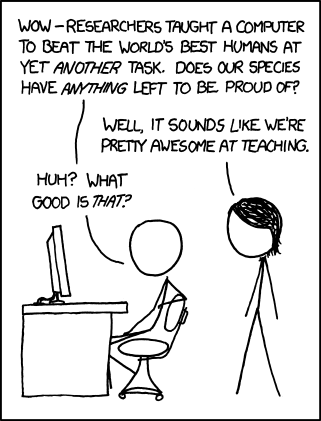

## A. Skills Development
* Linear and Matrix Algebra
* Diversify your Programming Languages (Python, SQL, C++, Java, etc.)
* Kaggle competitions
* [Computefest 2020](https://computefest.seas.harvard.edu/)
* [Data Science Meetups in Boston](https://www.meetup.com/topics/data-science/us/ma/boston/?_cookie-check=nhT68rU50hwPaQWQ)

## B. Spring Data Science Courses

### BST 263 - Applied Machine Learning (Full Spring)
* **Language: R or Python**
* Material: [An Introduction to Statistical Learning](http://www-bcf.usc.edu/~gareth/ISL/ISLR%20Seventh%20Printing.pdf)
* Additional Reading: [The Elements of Statistical Learning](https://web.stanford.edu/~hastie/Papers/ESLII.pdf)
* Probability Basics
* Assessing Model Accuracy
* Linear and Logistic Regression
* Classification
* Cross-validation and bootstrap
* Subset selection, Penalty-based methods
* Ridge regression and LASSO
* Dimension Reduction
* Polynomial Regression
* Step functions and Basis functions
* Generalized Additive Models (GAMs)
* Classification and Regression Trees (CART)
* Bagging and Random Forests
* Ensembles
* Support Vector Machines
* Unsupervised Learning
* Bayesian Methods

### BST 261 - Data Science 2 (Spring 2)
* **Language: Python**
* Material: [Deep Learning](http://www.deeplearningbook.org/)
* Brief review of Python 3
* Brief review of Linear Algebra and Probability
* Brief review of Machine Learning
* Feedforward Neural Networks
* Convolutional Neural Networks
* Recurrent Neural Networks
* Generative Adversarial Networks (GANs)
* Reinforcement Learning
* Transfer Learning
* Hyperparameter Tuning
* Model Selection

### BST 234 - Introduction to Data Structures and Algorithms (Full Spring)
* **Language: Python**
* Overview of numerical analysis material
* Concepts of Algorithms, Complexity and Sorting Algorithms
* Data Structures and Heapsort
* Parallel Programming
* Greedy Algorithms and Dynamic Programming
* Numerical Stability
* (Pseudo) Random Number Generation
* Efficient Algorithms for Linear Algebra
* Least-Squares Problem, Eigenvalue Decompositions
* Algorithms for Numerical Integration, MC-Integration, Importance Sampling
* Graphs and Network Algorithms

## C. Other Courses

* BST 262: Computing for Big Data (only offered in Fall 2)
* BST 267: Introduction to Social and Biological Networks (only offered in Fall 2)
* APMTH 120: Applied Linear Algebra and Big Data (offered in Spring, main campus)
* Other machine learning and NLP courses at Harvard and MIT 
	* Caution: these tend to be very difficult

## D. Data Science Applications
* [Diagnosing Pneumonia](https://news.stanford.edu/2017/11/15/algorithm-outperforms-radiologists-diagnosing-pneumonia/)
* [Tumor Classification](https://www.sciencebuddies.org/blog/artificial-intelligence-and-cancer-diagnosis-meet-the-2012-google-science-fair-winner)
* [Precision Medicine](https://www.forbes.com/sites/oreillymedia/2012/08/20/data-science-and-the-health-care-revolution/#33d787f129f7)
* [Image Denoising](https://www.ncbi.nlm.nih.gov/pmc/articles/PMC6225344/)
* [Digital Phenotyping](https://www.hsph.harvard.edu/onnela-lab/)

## E. Become a TA
We are in desperate need for TAs for our data science courses at Harvard Chan! Keep this in mind if you're looking for some extra money next year 😁

